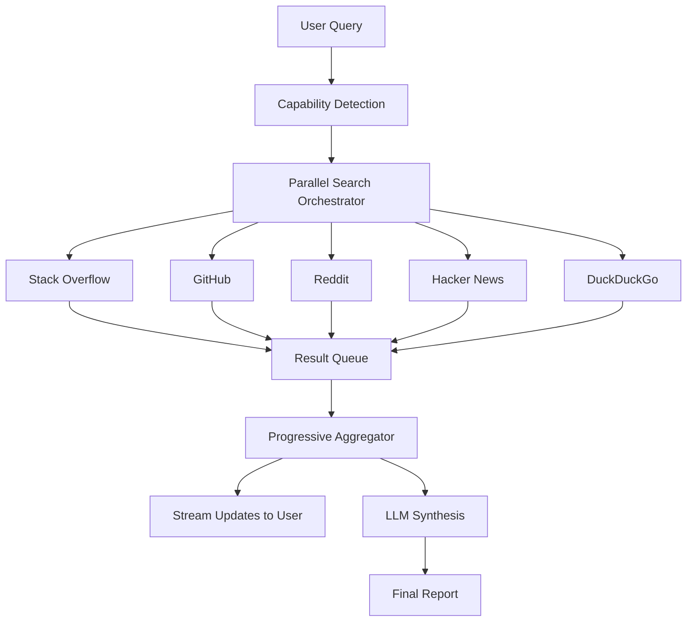

# System Architecture

## High-Level Overview

The Community Research MCP is designed as a **parallel, event-driven system**. It leverages `asyncio` to manage multiple concurrent search tasks and streams results back to the user in real-time.

## Core Components

### 1. Search Modules
- **`community_research_mcp.py`**: The core server and tool definitions.
- **`streaming_search.py`**: Handles the parallel execution logic using `asyncio.gather` and `asyncio.Queue`.
- **`streaming_capabilities.py`**: Manages result classification (Quick Fix vs. Discussion) and progressive aggregation state.

### 2. Data Flow
1.  **Request**: User calls a tool (e.g., `streaming_community_search`).
2.  **Dispatch**: The orchestrator launches async tasks for each enabled provider.
3.  **Collection**: Results are pushed to a FIFO queue as they complete.
4.  **Aggregation**: The `ProgressiveAggregator` processes queue items, updates the state, and yields intermediate results.
5.  **Enrichment**: For Deep Research, top URLs are fetched via `fetch_page_content`.
6.  **Synthesis**: Once all tasks complete (or timeout), the accumulated data is sent to the LLM for final synthesis.

### 3. Caching Strategy
- **File**: `.community_research_cache.json`
- **Key**: Hash of `(query, language, tool_name)`
- **TTL**: Results are valid for 24 hours (configurable).
- **Mechanism**: Read-through cache. If found on disk, return immediately. If not, fetch and save.

## Dependencies

- **`mcp`**: The Model Context Protocol SDK.
- **`httpx`**: Async HTTP client for all API calls.
- **`beautifulsoup4`**: For parsing HTML from DuckDuckGo and Active Browsing.
- **`asyncio`**: Standard library for concurrency.
